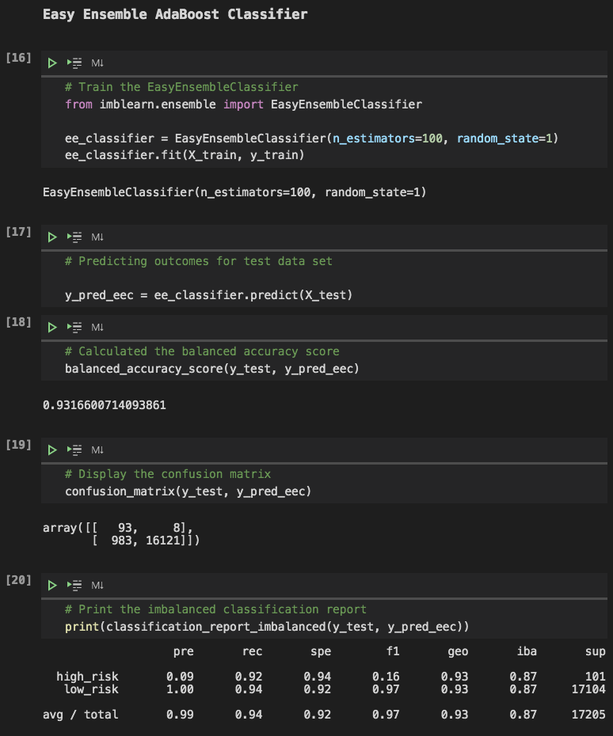

# **Credit_Risk_Analysis**  

## **Overview of Project**
In this project we are performing analyses on a credit dataset from LendingClub (a peer-to-peer lending services company), to predict the credit risk of each loan application using machine learning models

### **Purpose**

Our data source is a table that contains 144 columns and almost 116,000 rows (applications). We chose 86 columns (features) from this dataset to work with in our analyses. [Fig. 1](screen_shots/1.png) shows a part of this dataset:

|*Fig. 1*|
:--:
||

&nbsp;

Using the provided dataset we are trying to train a model to predict the credit risk of an application.
&nbsp;

## **Results**  

For this project we used Jupyter notebook and Pandas, sklearn and imblearn packages. First,we dropped the data points that their "loan_status" were "Issued", then the rest of the data were divided into two groups regarding their loan status, Low risk (68,470 data points) and High risk (347 data points). After cleaning the dataset and converting the string values to numerical ones we ended up with a dataframe with 95 columns (features) and almost 69,000 rows. the "loan_status" was chosen as the target (y) and the rest was used as the features (X). We split the data in each datasets(X and y) to create our training and testing sets. Having the data ready for our analyses we implemented following methods an models to predict the credit risk of an application:
1. Oversampling the high risk class in training dataset with Random Oversampling method and using logistic regression model
2. Oversampling the high risk class in training dataset with SMOTE method and using logistic regression model
3. Undersampling the low risk class in training dataset with Cluster Centroids method and using logistic regression model
4. Using a combinatorial approach of over and undersampling with the SMOTEENN algorithm, and logistic regression model
5. Using Balanced Random Forest Classifier to model the data
6. Using Easy Ensemble Classifier model to predict the outcomes
&nbsp;

in this section we will discuss the accuracy, precision and recall scores of these machine learning models

- ([Fig. 2](screen_shots/ros.png)) shows the code and the result for over sampling with Random Oversampler and logistic regression model. the balanced accuracy score which is the average of the recall scores obtained for each class is 0.64 for this model. This model has a very poor precision for High risk class (0.01) that means if this model predicts an application as a high risk one there is only one percent chance that this prediction is correct. we can see in the confusion matrix that there is 68 correct prediction for high risk applications (from 101 high risk applications presented in the testing data set) but this model also has 6,854 false positive predictions for this class too, that means 6,854 trustworthy candidates were flagged as high risks. The recall for the high risk class, on the other hand, is 0.67 this means if an application is actually a high risk one there is a 67% chance that this model will identify it correctly as high risk. The precision of this model regarding the low risk applications is 1 that means if this model predict an application as a good one we can trust it. the recall for the low risk class is 0.6 that means if a candidate is trustworthy there is still 40% chance that this model predict the application as a risky one.
the F1 score, which is the harmonic mean of precision score and recall score for a class, is 0.02 for high risk class which is a very low score and 0.75 for low risk class

  

  |*Fig. 2: Random Oversampling method and logistic regression model*|
  :--:
  ||
  

  &nbsp;

- ([Fig. 3](screen_shots/smote.png)) shows the code and the result for over sampling with SMOTE method and logistic regression model. Using this method of oversampling we can't see any significant change in the result of the model. The balanced accuracy score is now 0.66, the precision of the model is still the same for both classes (0.01 for high risk class and 1 for low risk class), the recall score for the high risk class is lower than the previous model and now is 0.63 and we can say that this model is a bit worse in picking high risk applications. The recall score for low risk class is 0.69 for this model. There is no change in F1 score for high risk class but F1 score of low risk class is now 0.82 

  

  |*Fig. 3: SMOTE method and logistic regression model*|
  :--:
  ||
  

  &nbsp;

- ([Fig. 4](screen_shots/cc.png)) shows the code and the result for under sampling with Cluster Centroid method and logistic regression model. The balanced accuracy score for this model is  0.54 which is lower than previous models. Using this method we have no significant improvement in the high risk class as the precision is still 0.01 and the recall score is 0.69. The F1 score for high risk class is now 0.01. We can also see that the recall score of the low risk class has dropped to 0.4 that means, using this model, there ia a 60% chance that a good loan application will be flagged as a risky one . This model has a lower F1 score for low risk class (0.57) compare to previous models  

  

  |*Fig. 4: Cluster Centroids method and logistic regression model*|
  :--:
  ||
  

  &nbsp;

- ([Fig. 5](screen_shots/smoteen.png)) shows the code and the result for SMOTEEN method and logistic regression model. The balanced accuracy score for this model is  0.64. The accuracy, precision and recall scores of this model is almost the same as the first model (where we used random oversampling). The precision scores are exactly the same as previous models (0.01 for high risk class and 1 for low risk class) and the recall scores for high risk and low risk classes are respectively 0.7 and 0.58. 

  

  |*Fig. 5: SMOTEENN algorithm and logistic regression model*|
  :--:
  ||
  

  &nbsp;

- ([Fig. 6](screen_shots/brf.png)) shows the code and the result for Balanced Random Forest Classifier model. The balanced accuracy score for this model is almost 0.79, which has improved compared to previous models. we can see a bit of improvement in the precision of high risk group  which is now 0.03 but it is still very low an far from ideal value. we have the same precision for low risk class as before. The recall score for the high risk class is 0.7 and The recall score for the low risk class has a higher value than previous models (0.87).  

  

  |*Fig. 6: Balanced Random Forest Classifier*|
  :--:
  ||
  

  &nbsp;

- ([Fig. 7](screen_shots/ee.png)) shows the code and the result for Easy Ensemble model. The balanced accuracy score for this model is  0.93 which is higher than all previous models. Using this model Improves the precision score for the high risk class to 0.09 (almost 10%) the recall scores for high risk and low risk groups are respectively 0.92 and 0.94.

  

  |*Fig. 7: Easy Ensemble Classifier*|
  :--:
  ||
  

  &nbsp;
## **summary**  

- According to what we discussed in result section of this report, all the models we used had perfect precision for low risk class and very poor precision score for high risk class, the best precision score for high risk group was 0.09 this means that if this model predicts an application as a high risk one there is 91% chance that it is actually a good application. On the other hand this model has almost perfect recall scores for both high risk and low risk classes (respectively 0.92 and 0.94) and there is more than 90% chance that if an application is actually  high risk or low risk it will be predict as one correctly. This suggests that this model is aggressive in picking the high risk applications as it is good in flagging actually high risk candidates but it also has a great number of false positives (good candidates predicted as risky ones).
- Based on what we discussed before, none of these model are recommended to be used for predicting the credit risk of an application, as all of them have a very low precision score for high risk class and would predict a large number of trustworthy candidates as high risk ones. But if the main goal of using a model is to identify as many high risk applications as possible and it is more important than having false positive predictions (in this case flagging low risk applications as high risk ones), then the Easy Ensemble Classifier is recommended which has the recall score of 0.94 for the high risk class. This model also has a precision score of 0.09 for high risk class which is slightly better than other models in this analysis.